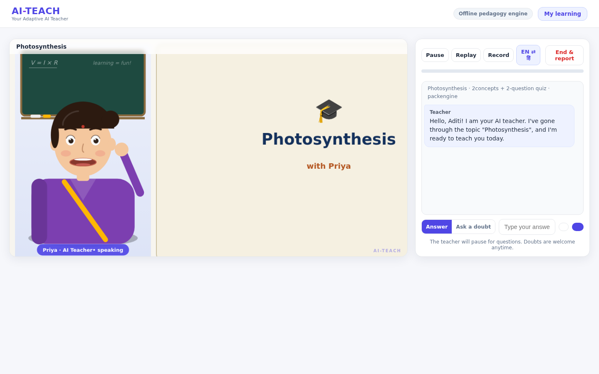
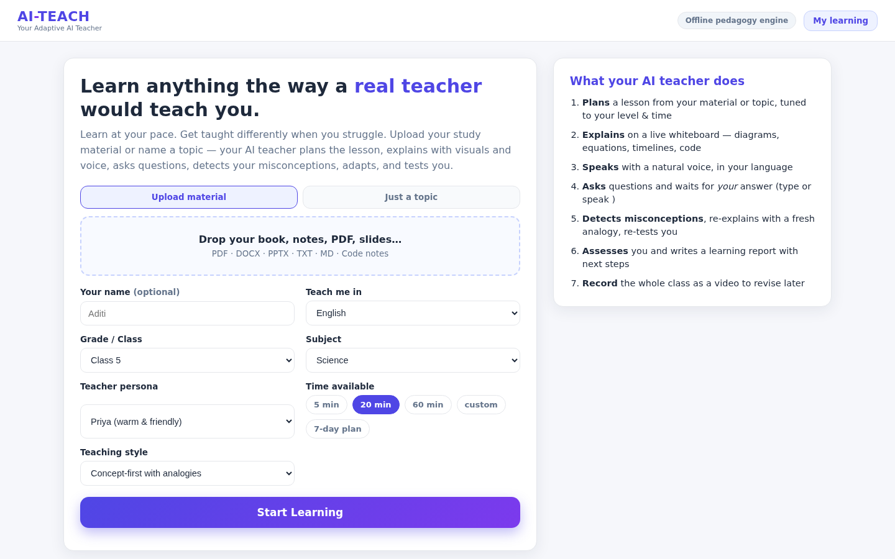
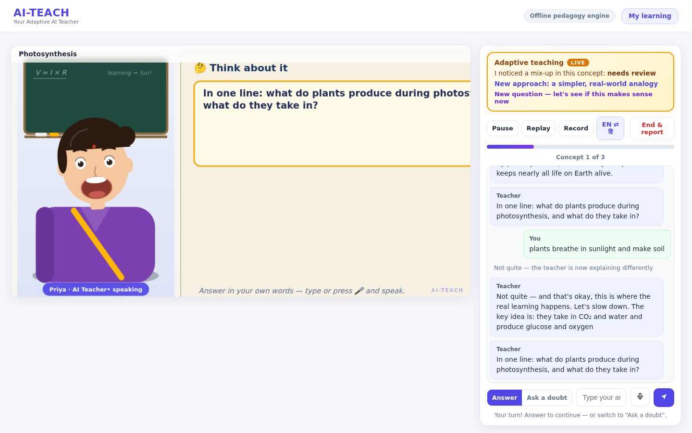
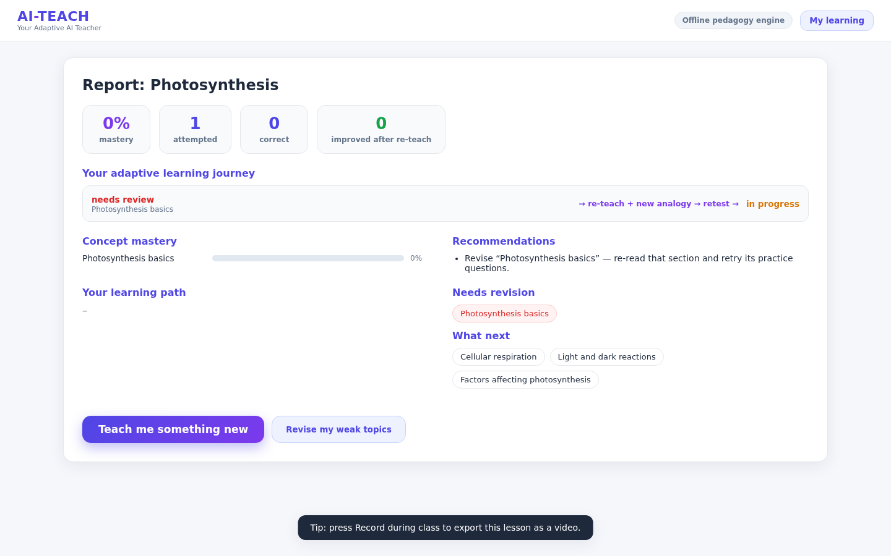
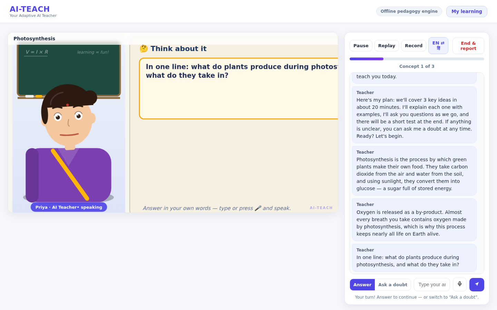
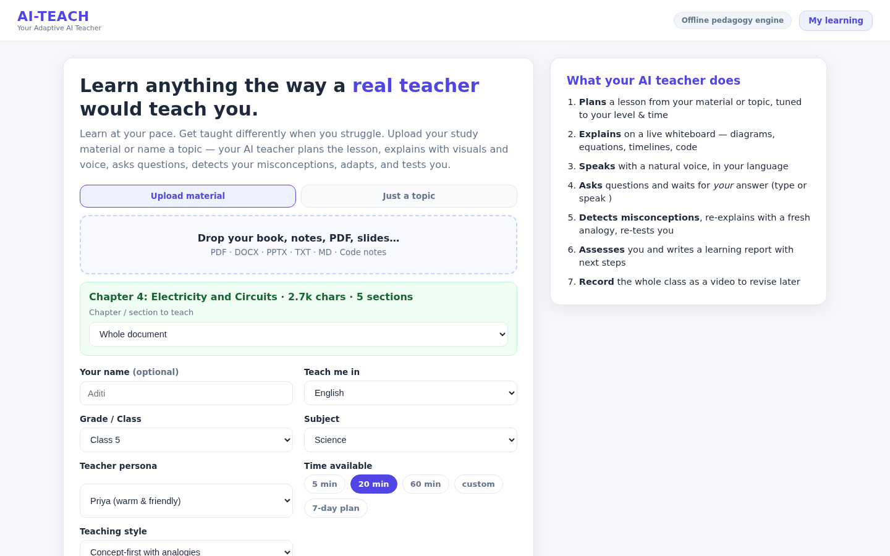

# AI-TEACH — Your Adaptive AI Teacher

> **A teacher, not a chatbot.**
> AI-TEACH plans a structured lesson from any topic or uploaded material, teaches it with a
> talking avatar, voice and live whiteboard, asks questions, detects misconceptions,
> **re-teaches with a new analogy**, re-tests you, and writes a report of every adaptive
> decision — in your language, tuned to your grade and your available time.



| Landing & setup | Classroom (avatar + whiteboard + voice) |
|---|---|
|  |  |

| Adaptive banner in action | Learning report |
|---|---|
|  |  |

| Question / assessment | Learning material upload |
|---|---|
|  |  |

## What it does

### Task 1 — AI Teaching video
- **Understands any input**: paste a topic, or upload a PDF / DOCX / PPTX / TXT / notes — the material is parsed, indexed (RAG) and the lesson is *grounded in your content*.
- **Structured lesson, not free-style chat**: every session starts with a plan — concept segments + quiz + (for long horizons) a multi-day study plan.
- **Adapted to the learner**: Grade/Class → difficulty level (beginner/intermediate/advanced), and your available time → lesson length. 5-minute sprint or 7-day plan.
- **Human-like teacher**: animated avatar with lip-sync, expressions and a natural voice (server TTS or browser voices), explaining on a live whiteboard — diagrams, equations, timelines, code, graphs.
- **Multilingual**: 12 languages. Full Hindi teaching **and full Hindi UI**. Honest, visible fallback when a language needs an AI key.
- **Delivered as video**: one-click **Record** exports the whole class (avatar + board + captions + voice) to a downloadable `.webm`.

### Task 2 — Interactive & adaptive
- **Asks and waits**: the teacher pauses per concept — free text, multiple choice, or push-to-talk (speech recognition).
- **Evaluates answers**: LLM grading, or rule-based + RAG-context grading offline.
- **Detects misconceptions by name**: classic traps (e.g. "more resistance → more current") are caught and labeled.
- **Re-explains differently**: misconception → visible **adaptive banner** → reteach with a *new* analogy → **fresh retest question**.
- **Changes difficulty**: wrong answers trigger easier retests; clean streaks raise challenge; hopeless topics are rescheduled for revision instead of blocking.
- **Answers doubts** mid-lesson with full context, then resumes the plan.
- **Final assessment + report**: quiz, score, concept-mastery bars, strong/weak areas, misconceptions found & fixed, and the complete **adaptive journey** (what was retaught and whether you improved), plus next-step recommendations and a one-click **"Revise my weak topics"** lesson.
- **Learner profile persists** across sessions (mastery over time, session history).

---

## Quick start

```bash
git clone https://github.com/<you>/ai-teacher.git
cd ai-teacher
pip install -r requirements.txt
python -m uvicorn app.main:app --host 0.0.0.0 --port 8000
# or simply: ./run.sh
```

Open **http://localhost:8000** in your browser (don't open the HTML file directly — the backend must be running).

### Optional: full AI quality
```bash
export OPENAI_API_KEY=sk-...
```
With a key, lessons/questions/grading are LLM-written and all 12 languages are fully supported.
**Without a key the app still works end-to-end** via the built-in offline pedagogy engine
(English / Hindi / Hinglish + curated topic packs + document-grounded lessons).

---

## 4-minute judge demo

See **[DEMO.md](DEMO.md)** — a scripted walkthrough that hits every rubric point:
topic → plan → avatar lesson → **intentionally wrong answer → adaptive banner → re-teach → retest** →
mid-lesson `EN ⇄ हिं` switch → report with the adaptive journey → learner profile.

---

## How it works

```
┌────────────────────────────┐        REST API         ┌──────────────────────────┐
│  web/ (vanilla JS, canvas) │  ◄──────────────────►  │  FastAPI  app/main.py    │
│  · landing/setup           │   /api/sessions        │  · tutor.py — planner +  │
│  · classroom loop          │   /next /answer /ask   │    adaptive lesson engine│
│  · whiteboard + avatar     │   /language /report    │  · pedagogy.py — packs,  │
│  · recorder (video export) │   /upload (RAG ingest) │    templates, languages  │
│  · i18n (EN/HI full UI)    │   /profile             │  · rag.py / ingest.py    │
└────────────────────────────┘                        │  · profile.py — learner  │
                                                      │    model (persistent)    │
                                                      └──────────────────────────┘
```

Every beat the engine emits is a small JSON: `{type, say, board, avatar, tag, progress}` —
the frontend renders it on the whiteboard, speaks it through the avatar, and uses
**tags** (`misconception`, `reteach`, `retest`, `improved`, `praise`) to drive the adaptive UI.

## Project structure

```
ai-teacher/
├── app/
│   ├── main.py        # FastAPI routes (sessions, answers, ask, language, report, upload, profile, tts)
│   ├── tutor.py       # LessonPlanner + TutorSession — the adaptive teaching engine
│   ├── pedagogy.py    # lesson templates, topic packs (Offline), 12-language registry
│   ├── rag.py         # chunking + retrieval over uploaded material
│   ├── ingest.py      # PDF/DOCX/PPTX/TXT/code parsing
│   ├── profile.py     # persistent learner model (mastery, history)
│   ├── llm.py         # LLM integration (optional, OPENAI_API_KEY)
│   └── tts.py         # server-side speech (optional)
├── web/               # frontend (no build step — vanilla HTML/CSS/JS)
│   ├── index.html
│   ├── css/style.css  # light educational theme
│   └── js/            # app, whiteboard, avatar, speech, recorder, i18n
├── docs/              # screenshots (real captures)
├── samples/           # sample notes to try the upload flow
├── DEMO.md            # judge demo script
├── run.sh             # one-command setup + launch
├── Procfile / Dockerfile / render.yaml   # deploy targets
└── requirements.txt
```

## Deploy

- **Render**: `render.yaml` included — New Web Service from repo, done.
- **Docker**: `docker build -t ai-teach . && docker run -p 8000:8000 ai-teach`
- **Any VM**: `pip install -r requirements.txt && python -m uvicorn app.main:app --host 0.0.0.0 --port 8000`
- Single worker only (sessions are in-memory); mount `/app/data` for persistent learner profiles on platforms with ephemeral disks.

## Environment variables

| Variable | Purpose | Required? |
|---|---|---|
| `OPENAI_API_KEY` | LLM-written lessons/grading + all 12 languages | No — offline engine covers EN/HI/Hinglish |
| `PORT` | Server port (default 8000) | No |

---

Built for the **"Build the AI Teacher of the Future"** hackathon — because a teacher doesn't
wait for questions; it plans, explains, asks, adapts, and makes sure you learned.
