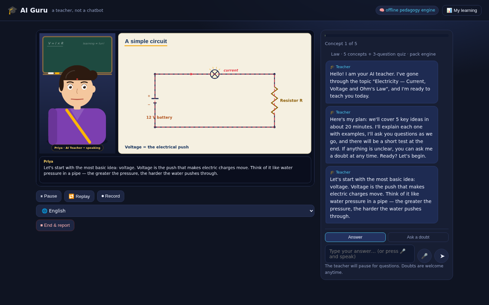
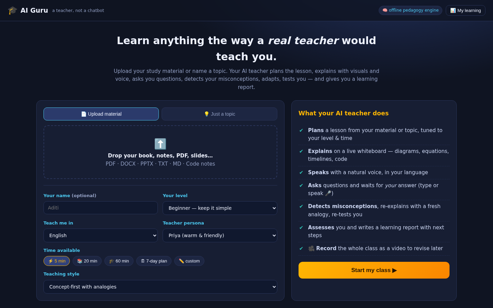
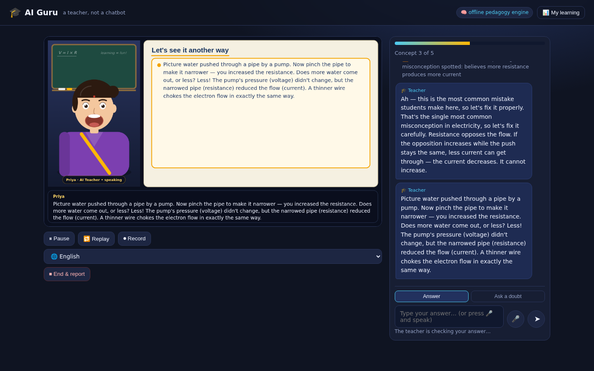
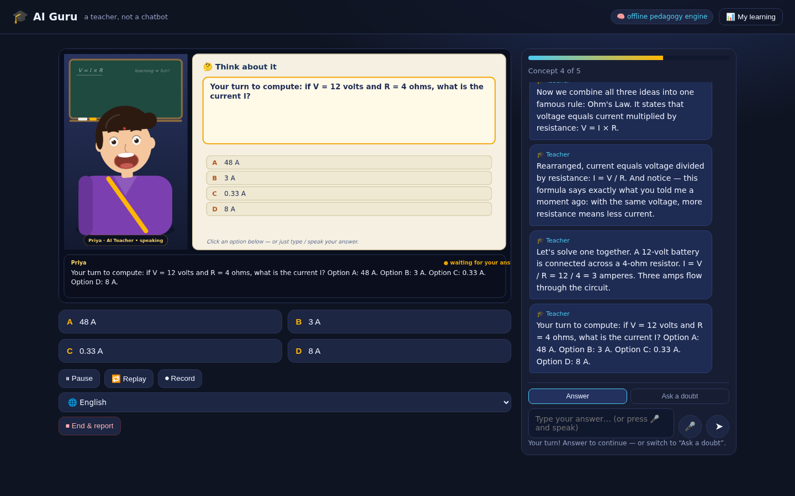
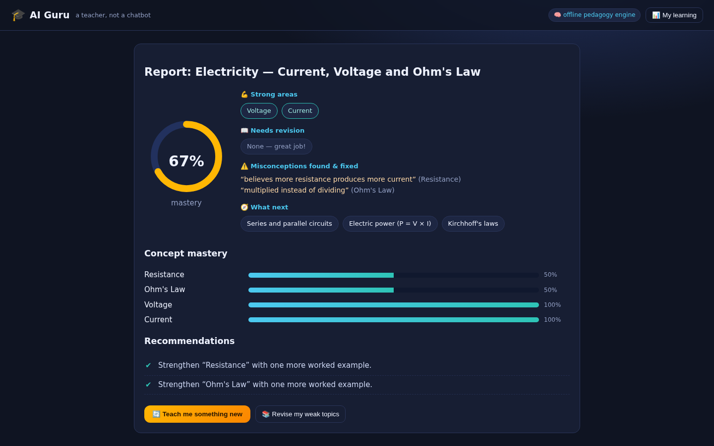

# 🎓 AI Guru — a Human-Like AI Teacher That Teaches Through Video

> **A teacher, not a chatbot.**
> AI Guru ingests your study material (or just a topic), plans a personalized lesson,
> teaches it through a **live animated AI-teacher classroom** — avatar, voice, whiteboard
> visuals — asks you questions, **detects your misconceptions**, re-teaches with fresh
> analogies, quizzes you, and writes a learning report with a recommended path forward.

Built for the *“AI Teacher”* challenge: a working prototype that demonstrates genuine
**Understanding → Planning → Explanation → Questioning → Evaluation → Adaptation**,
not a Q&A bot and not a talking-head reading a script.



| Setup | Adaptive remediation | MCQ interaction |
|---|---|---|
|  |  |  |

| Hindi lesson | Learning report |
|---|---|
|  |  |

---

## 1. The 60-second demo (offline, no API key needed)

```bash
./run.sh           # installs deps + starts http://localhost:8000
```

1. **Topic tab → ⚡ Ohm's Law**, level *Beginner*, language *हिन्दी (Hindi)*, *20 min* → **Start my class**.
2. Your teacher (Priya) greets you in Hindi, walks through Voltage → Current → Resistance
   → Ohm's Law on the whiteboard (circuit with animated current flow, the V-I-R triangle,
   the I–V graph), and **asks questions after every concept**.
3. When she asks *“— if resistance increases at constant voltage, what happens to current?”*
   answer wrong on purpose: **“current increases”**.
   → She names the misconception, explains *why* it’s wrong, switches to the
   **water-pipe analogy**, then re-tests you with a new question. That is §12 of the brief, live.
4. Answer (or press 🎤 and *speak* your answer). Switch language mid-lesson with 🌐.
   Ask a doubt any time with the **Ask a doubt** toggle.
5. Finish the quiz → get your **learning report**: score, strong/weak concepts,
   misconceptions found & fixed, revision advice, next topics.
6. Press **⏺ Record** during class → download the whole class as a **.webm video lesson**.
7. Upload `samples/electricity_notes.txt` (or any PDF/DOCX/PPTX) to watch it
   **learn from your material** and teach a selected chapter with grounded content.

With an LLM key the same flow works for **any topic, any material, any language** (see §6).

---

## 2. Feature map against the problem statement

| Requirement (§) | How AI Guru implements it |
|---|---|
| Material learning (3) | Upload **PDF / DOCX / PPTX / TXT / MD / code notes** → text extraction → outline & section picker → **TF-IDF RAG** grounding (chunks injected into planner & doubt-answering) |
| Topic-based teaching (4) | Any topic via LLM planner; offline, three full curriculum packs (Electricity, Photosynthesis, Newton’s Laws) + learning-path scaffolds |
| Lesson structure (§1) | JSON lesson plan: progressive segments × {script, example, analogy, visual, check-question with misconception map} + final quiz |
| Human-like teaching (5) | State-machine tutor: **greet → agenda → explain → question → evaluate → (misconception → re-teach with new analogy → re-evaluate) → continue → quiz → report** |
| Personalization (6) | Level (beginner/intermediate/advanced changes depth & language), goal/style (concept-first, exam, interview, story), persona, name, time |
| Time-based learning (7) | 5/20/60 min scales segment count, depth and quiz size; **“7 days”** switches to a generated day-by-day study plan with spaced revision |
| Multilingual (8) | Full curricula + teacher-talk templates in **English, Hindi, Hinglish** offline; live language switch mid-lesson; any language with an LLM key; Devanagari-aware grading |
| AI teaching video (9) | The classroom itself is a rendered video scene; **Record** exports avatar + whiteboard + captions (and voice with server TTS) as `.webm` |
| Subject-aware visuals (10) | Visual kind selected by subject: `circuit`, `triangle`, `graph` (physics/math), `equation_steps` (math), `timeline` (history), `code` (programming), `flow` (processes), `bullets`. Heuristic detector for the offline engine; LLM instructed for the rest |
| Interactive learning (11) | Open, MCQ, numeric, “explain in your own words” questions; typed or **spoken** answers; doubts anytime |
| Misconception detection (12) | Every check question carries a **misconception map** (patterns/options → label, targeted feedback, *different* analogy, fresh follow-up question); the famous *“current increases with resistance”* trap is built in |
| Assessment & feedback (13) | Quiz + concept-wise mastery → report: **score, strong/weak areas, misconceptions, recommendations, next topics** |
| Learner profile (14) | Persistent profile (history, per-concept mastery over time) — “📊 My learning” drawer |
| Learning path (15) | Generated concept paths (e.g. the ML 8-step path from the brief), shown in class and in the report; “Revise my weak topics” button starts an adaptive revision session |
| Working prototype (17) | This repo — FastAPI backend + zero-build frontend, runs anywhere |

---

## 3. Architecture

```
┌─────────────────────────── Browser (zero-build frontend) ───────────────────────────┐
│  index.html   setup · classroom · report · profile drawer                           │
│  app.js       session orchestration, beat loop, chat, MCQ, controls                 │
│  avatar.js    animated teacher: lip-sync, expressions, gestures, 2 personas         │
│  whiteboard.js circuit / triangle / graph / steps / flow / timeline / code …        │
│  speech.js    Web Speech API TTS+STT (en-IN, hi-IN…) or server neural TTS           │
│  recorder.js  MediaRecorder: canvas.captureStream → lesson .webm                    │
└──────────────▲───────────────────────────────────────────────────────────────────┘
               │ REST (JSON beats: say + board + avatar + question)
┌──────────────┴──────────────────────── FastAPI backend ─────────────────────────────┐
│  main.py      /upload /sessions /next /answer /ask /language /report /profile /tts  │
│  tutor.py     LessonPlanner + TutorSession state machine, adaptive remediation,     │
│               grading (LLM rubric ⇄ keyword/misconception rules), report builder    │
│  pedagogy.py  teacher-talk templates (en/hi/hinglish) + curriculum packs + paths    │
│  ingest.py    PDF/DOCX/PPTX/TXT parsing · outline · section slicing · formula detect│
│  rag.py       paragraph chunking + TF-IDF retriever + key-concept extraction        │
│  llm.py       OpenAI-compatible client (urllib only); every call degrades safely    │
│  profile.py   persistent learner profile (JSON)                                     │
└─────────────────────────────────────────────────────────────────────────────────────┘
```

**Data flow:** document → parse → chunk → (concepts, outline, formulas) → *LessonPlanner*
(LLM-first, deterministic fallback) → `plan{segments, quiz, next_topics, path}` →
*TutorSession* emits **beats** (`say`, `board`, `avatar`, `question`) → frontend renders,
speaks, records → answers go back for grading → stats → **report + profile**.

---

## 4. The teaching engine (why this is a teacher, not a chatbot)

* **Plans before speaking.** The planner fixes concept order (simple→complex), picks the
  visual per concept, pre-writes each check question *with the 1–2 misconceptions students
  most likely have*, and scales everything to the available minutes.
* **Waits, listens, grades.** Each segment ends in a check question. Open answers are graded
  semantically (LLM rubric when connected; synonym/stem keyword rules + Devanagari matching
  offline). MCQ answers resolve letters, numbers or spoken option text.
* **Misconception-aware remediation.** A wrong answer isn’t just marked wrong:
  the matched misconception triggers *targeted* feedback (“you multiplied, but I = V/R
  divides”), a **different** analogy (water pipe, rooftop tank, highway), and a **fresh
  follow-up question**. Get it right → praise and move on. Miss again → kind answer-reveal,
  concept logged as weak, and it resurfaces in the final quiz and the revision mode.
* **Adapts.** Skipped concepts’ questions are recycled into the quiz; consecutive strong
  answers raise pacing; the report’s *“Revise my weak topics”* button literally starts a
  new 10-minute session on exactly your weak concepts.
* **Grounded doubts.** Mid-lesson doubts search the uploaded material (TF-IDF) and are
  answered from the textbook lines themselves; off-topic questions are gracefully deferred.

## 5. RAG & knowledge grounding

* `ingest.py` extracts text per format, detects headings (numbered/markdown/all-caps) for
  the **section picker**, slices the chosen chapter, and regex-detects formulas
  (`I = V/R`) which automatically become **inverse/direct-relation misconception questions**.
* `rag.py` chunks paragraphs (~700 chars, 120 overlap, heading-aware) and builds a TF-IDF
  index. Retrieval feeds: LLM planner context (≤4.2k chars with *“ground ONLY in this
  material”*), doubt answering, and grading context.
* Offline, the retriever directly grounds the generated lesson: segment scripts quote the
  document’s own sentences, and check questions target its key concepts — so answers stay
  faithful to the upload.

## 6. AI/ML models, APIs & third-party services (full disclosure)

| Component | Default (this repo, offline) | Optional (env-configured) |
|---|---|---|
| LLM (planning, grading, doubts, translation) | deterministic pedagogy engine + curriculum packs | any **OpenAI-compatible** API: `OPENAI_API_KEY`, `OPENAI_BASE_URL`, `AI_TEACHER_MODEL` (OpenAI, OpenRouter, Azure, Ollama, vLLM…) |
| Embeddings / vector DB | in-memory TF-IDF (scikit-free, ~60 lines) | swap `rag.py` for embeddings + FAISS/Chroma |
| TTS (voice) | browser **Web Speech API** (`en-IN`, `hi-IN`, …) — free, offline | `gTTS` or `edge-tts` (`AI_TEACHER_TTS=gtts|edge`, neural Hindi voices) |
| STT | browser Web Speech API (Chrome) | — |
| Avatar | real-time canvas avatar (lip-sync, expressions, personas) | HeyGen/D-ID can replace `avatar.js` at the beat boundary |
| Video export | MediaRecorder on the composited canvas | — |
| Libraries | FastAPI, Uvicorn, pypdf, python-docx, python-pptx | — |

**No API key is required to run or demo the product.** Every LLM call is wrapped —
failure or absence falls back to the built-in engine, so judges always see a working app.

## 7. Prompt / agent architecture (LLM mode)

* **Planner prompt** — *“expert instructional designer”*: receives profile (level, language,
  minutes, style) + RAG material; returns strict JSON (segments with script/visual/check+
  **misconception map**, quiz, next_topics). Sanitized defensively before use.
* **Grader prompt** — returns `{score, misconception, feedback}` for open answers
  (generous on phrasing, strict on concepts), with retrieved context.
* **Doubt prompt** — answers in ≤70 words, *only* from retrieved material when present.
* **Study-plan prompt** — day-wise JSON with spaced revision and a self-test day.
* **Translator** — mid-lesson language switch re-localizes upcoming beats (cached).

## 8. Voice, avatar & video approach

* **Voice:** Web Speech API with Indian-English/Hindi voices; rate/pitch tuned per persona;
  pluggable server TTS for studio-quality neural voices (then also mixed into recordings).
* **Avatar:** a fully procedural canvas teacher — no stock video. Phoneme-energy **lip sync**
  driven by speech events, blinking, eyebrow/head-tilt expressions (`explain · ask · happy ·
  think · greet`), waving greeting, nodding while explaining; two personas (Priya / Prof. Sharma).
* **Video:** avatar + whiteboard + captions are composited into one 1280×720 canvas at 30 fps;
  `MediaRecorder` exports the lesson as `.webm`. With server TTS the voice is captured via
  WebAudio into the same file (browser-native TTS can’t be captured — captions carry the script).

## 9. Assessment methodology

Score = weighted correctness over every interaction (checks **and** quiz), per concept:
`mastery = Σscore / attempts` → strong ≥ 0.75, weak < 0.5. Reports include per-concept bars,
the misconception trail (“what you believed → what we fixed”), concrete revision actions,
and next-topic recommendations; everything is persisted to the learner profile
(`data/profile.json`) and reused to personalize future sessions.

## 10. Setup

```bash
git clone <your-repo> && cd ai-teacher
./run.sh                          # -> http://localhost:8000
```

Optional superpowers:

```bash
export OPENAI_API_KEY=...                    # any topic / any language / LLM grading
export OPENAI_BASE_URL=https://openrouter.ai/api/v1   # or Ollama/vLLM/Azure
export AI_TEACHER_MODEL=gpt-4o-mini
pip install edge-tts && export AI_TEACHER_TTS=edge    # neural voices (great Hindi)
```

## 10b. Push to GitHub

```bash
cd ai-teacher
git init && git add -A && git commit -m "🎓 AI Guru — AI teacher with adaptive lessons"
git branch -M main
git remote add origin git@github.com:<you>/ai-guru.git
git push -u origin main
```

## 10c. Deploy (pick one)

**A. Render (free, one click)** — the repo ships `render.yaml`:
Render Dashboard → *New → Blueprint* → point at the repo → Deploy. Done.
(Optionally add `OPENAI_API_KEY` in the Environment tab.)

**B. Railway / Heroku-style** — the repo ships a `Procfile`; set the Python buildpack
and the start command `uvicorn app.main:app --host 0.0.0.0 --port $PORT` is used automatically.

**C. Docker (any VPS / Fly.io / Cloud Run)**

```bash
docker build -t ai-guru .
docker run -p 8000:8000 -e OPENAI_API_KEY=$OPENAI_API_KEY ai-guru
# → http://localhost:8000   (health endpoint: /healthz)
```

> ⚠️ Sessions are kept in one process's memory — run **one** uvicorn worker
> (the Dockerfile already does), or front it with a single-instance service.
> The learner *profile* persists on disk; mount a volume at `/app/data` to keep it.

**D. Hugging Face Spaces** — use the *Docker SDK*, push this repo, set the app port to `7860`:

```bash
docker run -e PORT=7860 ai-guru   # Spaces routes to $PORT automatically
```

Structure:
```
ai-teacher/
├── app/            FastAPI backend (engine, planner, RAG, ingest, pedagogy, profile)
├── web/            zero-build frontend (classroom, avatar, whiteboard, recorder)
├── samples/        electricity_notes.txt — try the upload flow instantly
├── scripts/        test_backend.py — end-to-end engine test (HTTP)
├── requirements.txt  run.sh  README.md
```

## 11. Known limitations (honest list)

* Offline mode covers English/Hindi/Hinglish fully and ships 3 curated curricula; arbitrary
  topics and all other languages need an LLM key (clearly marked in the UI).
* The avatar is a procedural 2D teacher (lip-sync + expressions), not a photorealistic
  human; the beat-level API is designed so a HeyGen/D-ID renderer can drop in.
* Exported video is muted when using browser-native TTS (browsers don’t allow capturing
  `speechSynthesis` audio); use `AI_TEACHER_TTS=edge` for narrated recordings.
* Speech-to-text needs Chrome/Edge; documents and sessions are kept in memory
  (profile persists to disk).
* Grading in pure-offline mode is keyword/misconception based (works well, incl. Hindi);
  LLM grading is more nuanced.

## 12. Why the jury should care

The demo’s centrepiece is the brief’s *own* example: say **“current increases”** when asked
about resistance, and the system (1) identifies the misconception, (2) explains the concept
again, (3) uses a **different** analogy, (4) asks a **new** question, (5) re-evaluates,
(6) logs it in your profile and schedules revision. That closed loop — plan, teach,
question, diagnose, remediate, reassess, remember — is what separates an AI *teacher*
from an AI *answerer*, and it runs end-to-end here, on a laptop, with zero API keys.
